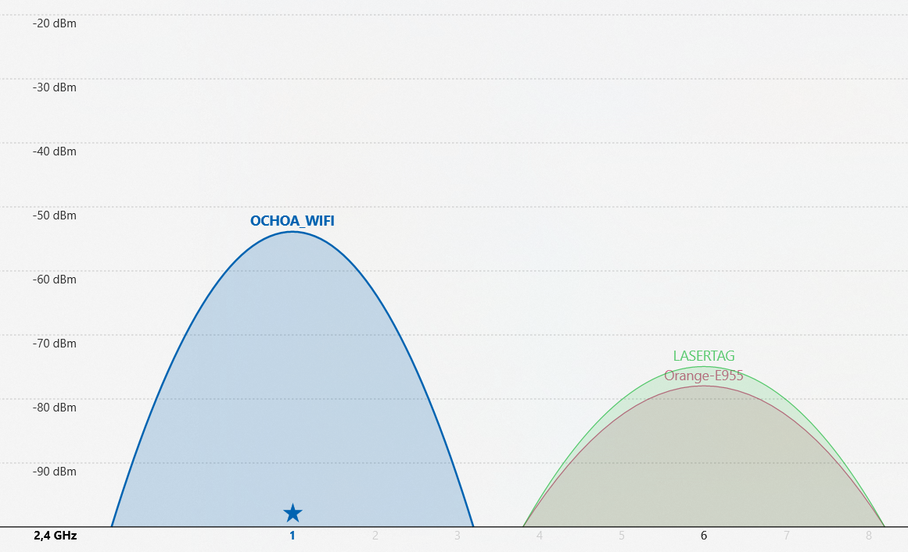
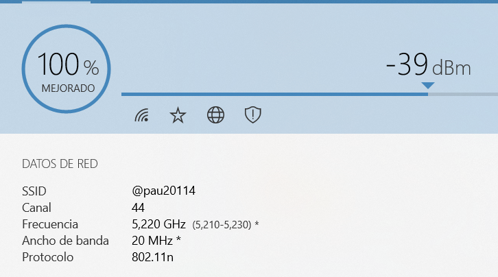

# Actividad para la Comprobación de Señal Wifi

1. Realiza la instalación de los dos programas que vamos a utilizar y adjunta capturas del resultado. (Acrylic WiFi Home y WiFi Analyzer)

**Primero instalaré el Wifi Analyzer**

**Ahora instalaré el Acrylic Wifi Home**

2. Abre WiFi Analyzer y adjunta una captura en la que se observe los datos de tu red y la intensidad de la señal recibida.

3. Indica en Acrylic WiFi Home si tu red tiene interferencias por otra red y adjunta una captura del resultado.

4. Dirigite a WiFi Analyzer y adjunta una captura gráfica del ancho de banda, el canal y la intensidad de tu red. Si tienes interferencias, ¿Qué solución aplicarías?

**Comprabamos si tenemos interferencias, en este caso no tenemos, pero si tuvieramos una solución puede ser cambiar el canal**

5. Activa el punto de acceso WiFi en tu smartphone y escoge de estos dos programas el que más te haya gustado, una vez elegido realiza un análisis de la acceso de tu teléfono donde indiques:

  * SSID
  * Canal
  * Intensidad recibida de la señal
  * Ancho de banda
  * Si se producen interferencias o no

**Voy a utilizar el programa Wifi Analyzer en el que podemos comprobar su información y si tenemos interferencias. En este caso no tenemos interferencias ya que estamos transmitien en la frecuencia de 5 GHz y no encontramos más redes que también se encuentren en esa frecuencia**

