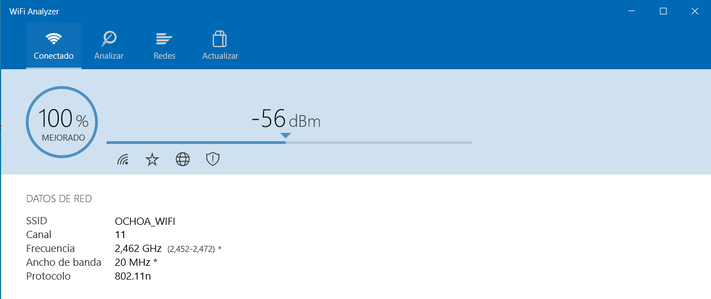
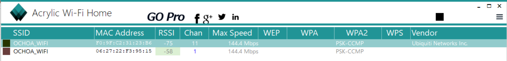
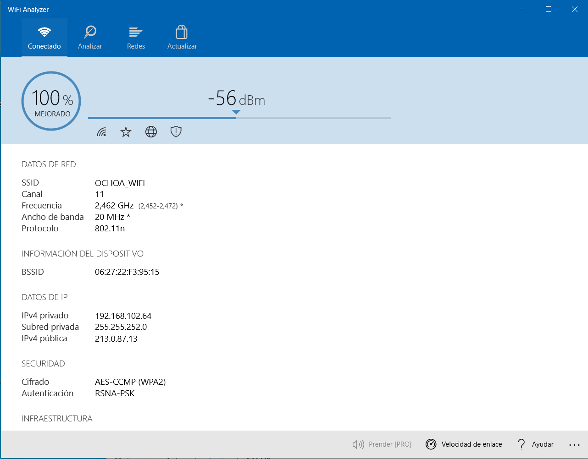
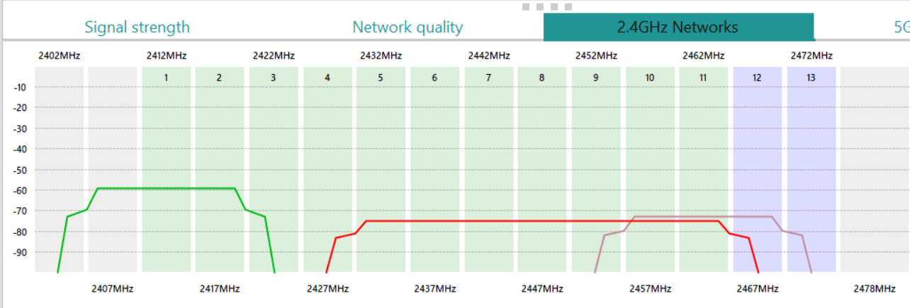

# Actividad para la Comprobación de Señal Wifi

1. Realiza la instalación de los dos programas que vamos a utilizar y adjunta capturas del resultado. (Acrylic WiFi Home y WiFi Analyzer)

**Primero instalaré el Wifi Analyzer**

**Ahora instalaré el Acrylic Wifi Home**

2. Abre WiFi Analyzer y adjunta una captura en la que se observe los datos de tu red y la intensidad de la señal recibida.

3. Indica en Acrylic WiFi Home si tu red tiene interferencias por otra red y adjunta una captura del resultado.

