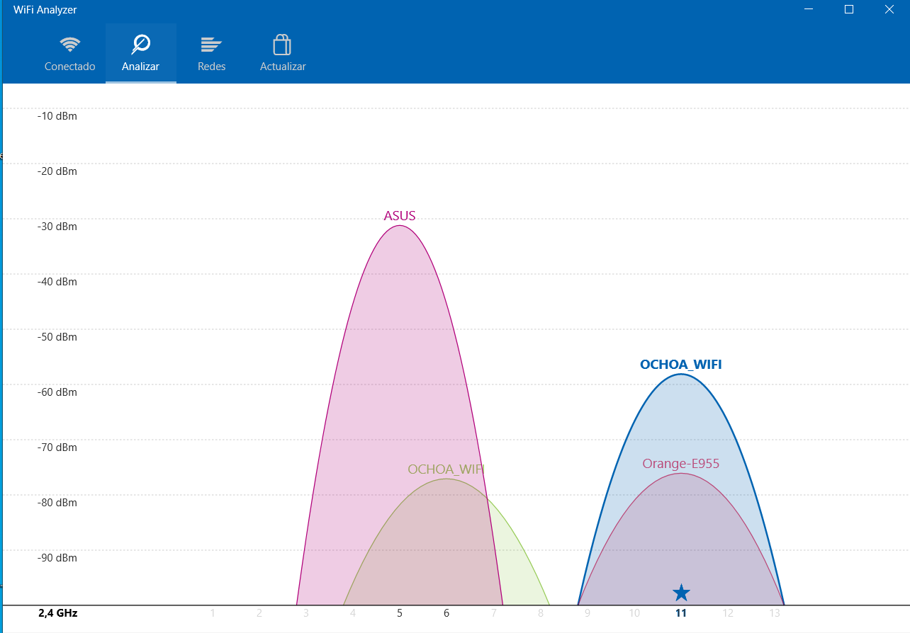

# Comprobar la intensidad y las interferencias de nuestra Red Wifi con "Wifi Analyzer"

¿Qué vamos a comprobar?
* **Intensidad (dBm)**
* **Interferencias**
* **Canal**
* **Frecuencia**

Abriremos el programa una vez descargado, deberemos estar conectados a la red wifi que queremos analizar.

Nada más entrar ya podemos ver la intensidad de nuestra red wifi, que es la potencia de la señal de nuestro wifi, que se mide en “dBm”, en este caso tenemos -56 dBm, la intensidad cuanto más cerca del 0 mejor.

La intensidad se puede ver afectada por la señal de otros routers, dependiendo en que **canal** estamos, la **frecuencia** a la que estamos trasmitiendo, etc.

Si entramos en **“Analizar”** veremos un gráfico de en que **canal** está cada red wifi que esté transmitiendo en nuestra misma **frecuencia**. En este caso tenemos en nuestro mismo **canal** otra red wifi, para que no tuvieramos **interferencias** deberíamos intentar buscar un **canal** que no hubiera ninguna red. O si nuestro router nos lo permite cambiar la **frecuencia** a **5 GHz**, ya que normalmente no hay el mismo número de redes.

